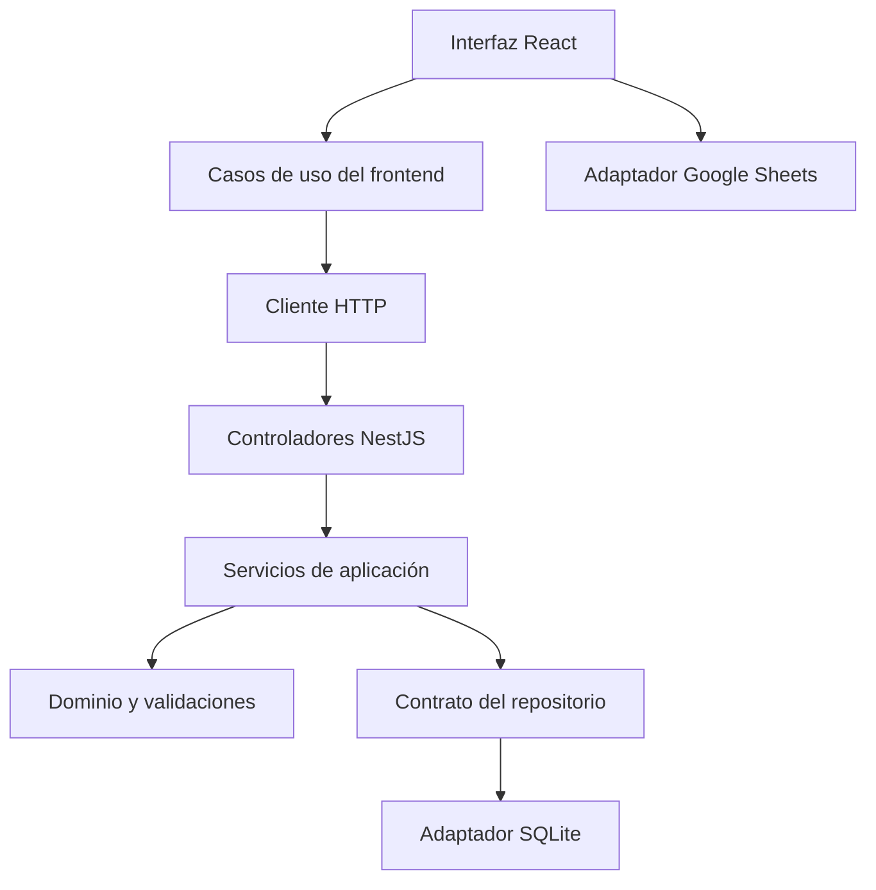

# FinanzApp · React y NestJS

Migración de la aplicación original de finanzas personales a un monorepositorio con frontend React, backend NestJS, TypeScript y SQLite. El archivo `index.html` original permanece disponible. La versión moderna se ejecuta desde `apps/web` y `apps/api`.

## Ejecutar en tu PC

Instala **Node.js 24** y Git. Desde una terminal:

```bash
git clone https://github.com/arvgit3010/finanzasapp_gemini.git
cd finanzasapp_gemini
git switch developer-react-nest
npm ci
npm run dev
```

Abre **http://localhost:5173**. `npm run dev` inicia React y NestJS juntos. La API escucha en `127.0.0.1:3000`; Vite reenvía `/api` al backend.

1. Define una contraseña de al menos ocho caracteres.
2. Escanea el QR con tu autenticador y guarda la clave manual.
3. Ingresa el código de seis dígitos.
4. Abre Configuración para importar tu respaldo JSON de la aplicación anterior.
5. Activa “Mostrar montos” cuando quieras consultar saldos y gráficos.

Si usas el mismo navegador y origen del sistema anterior, puedes usar “Importar datos del navegador anterior”. Si cambiaste de dominio o puerto, exporta JSON desde la aplicación original: el almacenamiento del navegador no se comparte entre orígenes. Las credenciales anteriores no se importan; la cuenta nueva se configura en el servidor, con contraseña y TOTP.

## Funciones

- Dashboard de ingresos, egresos, saldo neto, bancos, gráficos por mes/categoría/persona y últimos movimientos.
- Bancos: agregar, editar, eliminar, color, número de cuenta y saldo calculado.
- Movimientos: ingresos/egresos, edición/eliminación, categorías y personas; filtros por tipo, banco, mes, persona y descripción.
- Préstamos: sin interés, interés simple sobre saldo o monto fijo por cuota; fechas por frecuencia en días, redondeo y ajuste final del capital, cuotas pagadas, activos y completados.
- Cuentas por pagar: estimado, real, diferencia, fecha, nota, estado, filtros y totales.
- Catálogos de categorías y personas que conservan los nombres existentes al importar.
- Exportación/restauración JSON y sincronización manual/automática con Google Sheets.
- Acceso con contraseña y autenticador, bloqueo durante cinco minutos después de cinco intentos fallidos y cierre de sesión.
- Interfaz adaptable a escritorio y celular; montos ocultos al iniciar.

## Capas

| Ubicación                      | Responsabilidad                                                      |
| ------------------------------ | -------------------------------------------------------------------- |
| `apps/web/src/presentacion`    | Componentes React, formularios, páginas y gráficos                   |
| `apps/web/src/aplicacion`      | Carga del estado, ejecución de comandos, errores y revisiones        |
| `apps/web/src/infraestructura` | Cliente HTTP y adaptador de Google Sheets                            |
| `packages/dominio/src`         | Entidades, validaciones, cronogramas, filtros y cálculos compartidos |
| `apps/api/src/presentacion`    | Controladores HTTP y guard de sesión                                 |
| `apps/api/src/aplicacion`      | Casos de uso financieros y autenticación                             |
| `apps/api/src/dominio`         | Contrato del repositorio                                             |
| `apps/api/src/infraestructura` | Repositorio SQLite                                                   |



La base de datos se crea automáticamente en **`data/finanzapp.sqlite`**. La API guarda cada cambio de forma atómica y controla una revisión para evitar que dos pestañas sobrescriban datos. El archivo contiene información financiera y la configuración de autenticación; debe respaldarse y protegerse. Las sesiones caducan en ocho horas y se invalidan al reiniciar el servidor.

## Compilar y validar

```bash
npm run build
npm test
npx playwright install chromium
npm run test:e2e
```

`npm test` compila frontend/backend, compara 216 cronogramas con el algoritmo original y valida cálculos, persistencia, importación, comandos y API autenticada. `npm run test:e2e` recorre la interfaz real con Chromium y genera capturas de escritorio y celular. `npm run check` ejecuta ambas suites. GitHub Actions ejecuta esas verificaciones al subir cambios o abrir un PR.

## Google Sheets

En Configuración, introduce el mismo cliente OAuth de Google Cloud del proyecto anterior. Habilita Sheets API y Drive API y autoriza `http://localhost:5173` como origen JavaScript. Para un despliegue, agrega también su origen HTTPS.

Conectar autoriza Google y busca la hoja **“FinanzApp — Mis Finanzas”**; permite leer o guardar manualmente. Después de conectar, los cambios se envían automáticamente con un pequeño retraso. El token se mantiene en memoria. Las pestañas originales `Movimientos`, `Bancos`, `Resumen`, `Prestamos` siguen siendo compatibles. La nueva versión agrega `Pagos`, `Categorias`, `Personas` para incluir esos datos. Los errores se muestran en la barra de sincronización.

La conexión requiere una cuenta Google y credenciales OAuth válidas. Las pruebas automatizadas simulan Google: no acceden a tu cuenta ni escriben en tus hojas reales. Exporta JSON antes de reemplazar datos en cualquiera de las dos direcciones.

## Ejecutar la compilación

```bash
npm run build
npm start
```

NestJS también sirve el frontend compilado en **http://127.0.0.1:3000**. Para permitir cambios desde ese origen, copia `.env.example` a `.env` en la raíz y cambia `FRONTEND_ORIGIN` a `http://127.0.0.1:3000`. En Windows puedes copiarlo desde el explorador o con `copy .env.example .env`.

Para publicar el sistema usa HTTPS, `COOKIE_SECURE=true`, `FRONTEND_ORIGIN` con tu dominio y un directorio persistente para `DATABASE_PATH`. `HOST=127.0.0.1` limita el acceso al equipo; detrás de un proxy o contenedor puede configurarse otro host. Configura la cuenta inicialmente desde tu equipo antes de exponer el servicio. Esta aplicación conserva el modelo personal de una sola cuenta; no incorpora multiusuario.

Consulta [la arquitectura y guía de mantenimiento](docs/ARQUITECTURA.md) y [la matriz de paridad y verificación](docs/PARIDAD.md).
